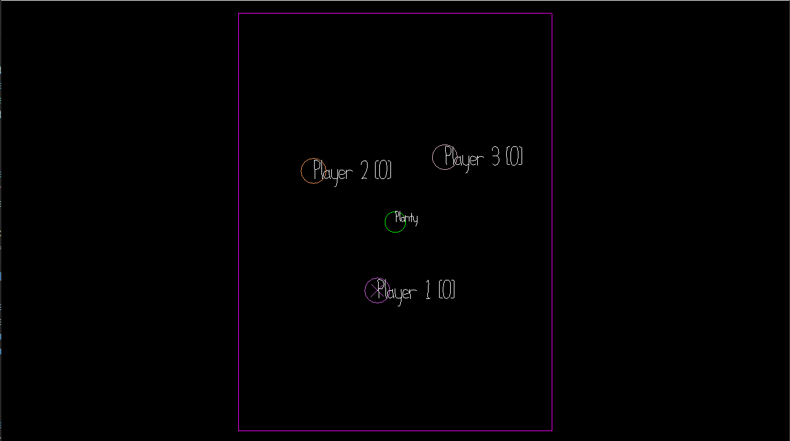

# Attack the Plant

Author: Vishant Raajkumar

Design: In this game, attack an plant that can't do any damage to you by running into it with your friends. Planty is evil because he's been haunting you for the last few weeks.
Only the last player to hit the plant gets points, so you'll want to be careful about when you commit for an attack.

Networking: The client/server multiplayer is implemented with the Connection interface from Connection.cpp. In Game.cpp, I built off of the starter code so that the player's score
is also transmitted although its a bit buggy.

Screen Shot:

How To Play:

Use WASD to move your player. The goal is to run into the plant.

Sources: All assets were created by me for game 3.

This game was built with [NEST](NEST.md).

